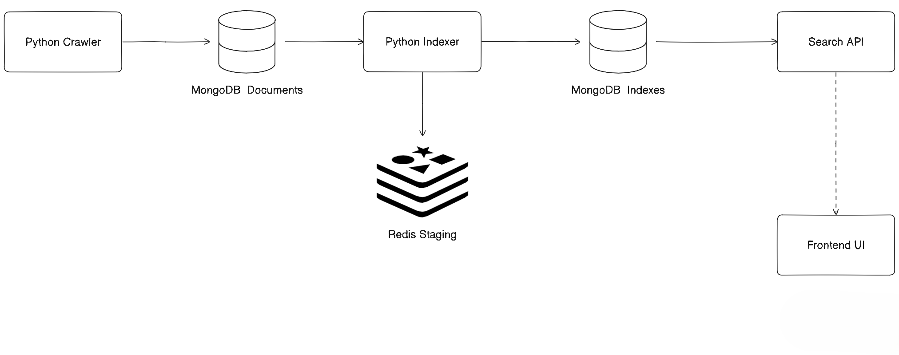

# Quack — A Search Engine

A fully self-contained web search engine built from scratch. Quack crawls the web, builds an inverted index with TF-IDF + PageRank scoring, and serves results through a REST API with a Google-like frontend.

---

## Architecture



## Features

- **Multi-threaded crawler** — 64 concurrent threads, up to 20,000 pages per run, configurable depth (default: 3)
- **URL normalization** — strips tracking parameters (`utm_*`, `fbclid`, etc.), deduplicates URLs, skips binary file extensions
- **Write buffering** — batches MongoDB writes (100 docs/flush) to reduce round-trips
- **TF-IDF scoring** — per-document term frequency × inverse document frequency, with a 2.5× title boost
- **PageRank** — computed via scipy sparse matrices (20 power iterations, 0.85 damping factor) on the crawled link graph
- **Redis staging** — posting lists are streamed to Redis with O(1) `RPUSH` during indexing, then bulk-flushed to MongoDB. Prevents slow array rewrites at scale
- **Consistent stemming** — Snowball stemmer (Python/NLTK) and Porter stemmer (Node.js/natural) with aligned stopword lists on both sides
- **Result caching** — 5-minute in-memory cache in the search API (`node-cache`)
- **XSS-safe frontend** — all user-supplied and fetched content is HTML-escaped before rendering

---

## Tech Stack

**Python dependencies**

- requests
- beautifulsoup4
- pymongo
- redis
- numpy
- scipy
- nltk

**Node.js dependencies**

- express
- mongodb
- natural
- node-cache
- cors

**Infrastructure**

- MongoDB (stores crawled documents + inverted index)
- Redis (temporary staging during index build)

---

## Prerequisites

- Python 3.10+
- Node.js 18+
- MongoDB running on `localhost:27017`
- Redis running on `localhost:6379`

Quick start with Docker:

```bash
docker run -d -p 27017:27017 mongo
docker run -d -p 6379:6379 redis:alpine
```

### Setup

1. Crawler

```bash
cd crawler
pip install requests beautifulsoup4 pymongo
python crawler.py
```

The crawler seeds from ~50 popular domains and follows links up to depth 3. Progress stats (crawled, failed, skipped, active threads) are printed to the console. Results land in the search_engine.documents MongoDB collection.

2. Indexer

```bash
cd indexer
pip install pymongo redis numpy scipy nltk
python indexer.py
```

The indexer runs 4 phases:

- Phase 0 — count total documents
- Phase 1 — tokenize all documents, compute document frequencies, cache tokens
- Phase 1b — build link graph and compute PageRank
- Phase 2 — compute TF-IDF per document, stream scored postings to Redis
- Phase 3 — flush Redis → MongoDB search_engine.index collection

Expect progress bars with rate (docs/s) and ETA at each phase.

3. Search API

```bash
cd searchAPI
npm install
npm start
```

The server starts on http://localhost:3000

Endpoint:
/search?q=<query>

Example response:

```json
{
  "query": "python asyncio",
  "count": 10,
  "results": [
    {
      "url": "https://docs.python.org/3/library/asyncio.html",
      "title": "asyncio — Asynchronous I/O",
      "snippet": "…asyncio is a library to write concurrent code using the async/await syntax…",
      "score": 0.004821
    }
  ]
}
```

4. Frontend
   Open index.html directly in a browser — no build step needed. It connects to the API at http://localhost:3000.

### How Ranking Works

For each search query:

- Query terms are tokenized and stemmed (matching the indexer pipeline)
- TF-IDF scores are fetched from the inverted index for each term
- Scores are summed across terms per document
- PageRank is combined with TF-IDF using a log-compression formula:

```
final_score = tfidf × (1 + log(1 + pagerank))
```

- Top 10 results are returned with a content snippet extracted around the first matching term
