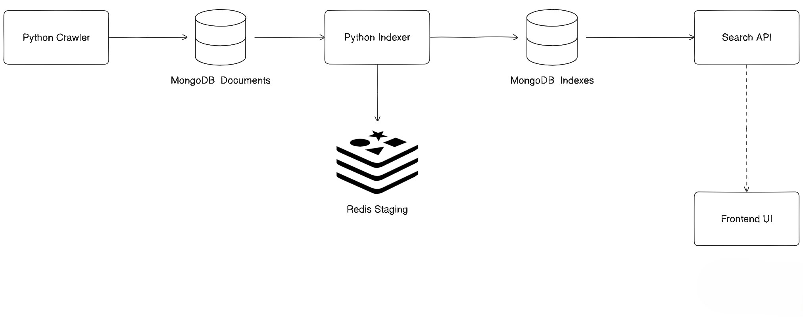

# Quack — A Search Engine

A fully self-contained web search engine built from scratch. Quack crawls the web, builds an inverted index with TF-IDF + PageRank scoring, and serves results through a REST API with a Google-like frontend.

---

## Architecture



## Features

- **Multi-threaded crawler** — 64 concurrent threads, up to 20,000 pages per run, configurable depth (default: 3)
- **URL normalization** — strips tracking parameters (`utm_*`, `fbclid`, etc.), deduplicates URLs, skips binary file extensions
- **Write buffering** — batches MongoDB writes (100 docs/flush) to reduce round-trips
- **TF-IDF scoring** — per-document term frequency × inverse document frequency, with a 2× title boost
- **PageRank** — computed via scipy sparse matrices (20 power iterations, 0.85 damping factor) on the crawled link graph
- **Redis staging** — posting lists are streamed to Redis with O(1) `RPUSH` during indexing, then bulk-flushed to MongoDB. Prevents slow array rewrites at scale
- **Stemming + stopword filtering** — applied at both ends of the pipeline: NLTK (Python) at index time, `natural` (Node.js) at query time. The two are not currently using the same algorithm — see [Known limitations](#known-limitations)
- **Result caching** — 5-minute in-memory cache in the search API (`node-cache`)
- **XSS-safe frontend** — all user-supplied and fetched content is HTML-escaped before rendering

---

## Tech Stack

**Python dependencies**

- requests
- beautifulsoup4
- pymongo
- redis
- numpy
- scipy
- nltk

**Node.js dependencies**

- express
- mongodb
- natural
- node-cache
- cors

**Infrastructure**

- MongoDB (stores crawled documents + inverted index)
- Redis (temporary staging during index build)

---

## Running with Docker (recommended)

MongoDB, Redis, the API and the UI all come up together:

```bash
docker compose up -d --build      # → http://localhost:3000
```

Then populate the data, in order. The crawler and indexer are run-to-completion
batch jobs rather than services, so they sit behind a `jobs` profile and are
invoked explicitly (both take hours — use `screen`/`tmux`):

```bash
docker compose run --rm crawler   # fills search_engine.documents
docker compose run --rm indexer   # builds search_engine.index
```

To deploy this on a single EC2 instance, see [DEPLOY.md](./DEPLOY.md) — it covers
instance sizing, the security-group rules, and the operational caveats.

---

## Running manually

**Prerequisites**

- Python 3.10+
- Node.js 18+
- MongoDB running on `localhost:27017`
- Redis running on `localhost:6379`

```bash
docker run -d -p 27017:27017 mongo
docker run -d -p 6379:6379 redis:alpine
```

### Setup

1. Crawler

```bash
cd crawler
pip install -r requirements.txt
python crawler.py
```

The crawler seeds from ~50 popular domains and follows links up to depth 3. Progress stats (crawled, failed, skipped, active threads) are printed to the console. Results land in the search_engine.documents MongoDB collection.

2. Indexer

```bash
cd indexer
pip install -r requirements.txt
python indexer.py
```

The indexer runs five phases:

- Phase 0 — count total documents
- Phase 1 — tokenize all documents, compute document frequencies, cache tokens
- Phase 1b — build link graph and compute PageRank
- Phase 2 — compute TF-IDF per document, stream scored postings to Redis
- Phase 3 — flush Redis → MongoDB search_engine.index collection

Expect progress bars with rate (docs/s) and ETA at each phase.

3. Search API

```bash
cd searchAPI
npm install
npm start
```

The server starts on http://localhost:3000

Endpoint:
/search?q=<query>

Example response:

```json
{
  "query": "python asyncio",
  "count": 10,
  "results": [
    {
      "url": "https://docs.python.org/3/library/asyncio.html",
      "title": "asyncio — Asynchronous I/O",
      "snippet": "…asyncio is a library to write concurrent code using the async/await syntax…",
      "score": 0.004821
    }
  ]
}
```

4. Frontend

The API serves the UI itself, so `http://localhost:3000/` is all you need — no
build step, no separate server. Opening `frontend/index.html` straight off disk
still works too: the page detects the `file://` protocol and falls back to
calling `http://localhost:3000`.

### Configuration

Every connection setting reads from an environment variable and falls back to
its original `localhost` value, so nothing above needs configuring to run
locally. Compose sets these for you; copy `.env.example` to `.env` to override.

| Variable | Default | Used by |
|---|---|---|
| `MONGO_URI` | `mongodb://localhost:27017/` | crawler, indexer, API |
| `MONGO_DB` | `search_engine` | crawler, indexer, API |
| `REDIS_HOST` / `REDIS_PORT` | `localhost` / `6379` | indexer |
| `PORT` / `HOST` | `3000` / `0.0.0.0` | API |
| `FRONTEND_DIR` | `../frontend` | API |

The frontend takes no build-time configuration — it derives its own API base
URL. Set `window.QUACK_API` before `script.js` loads to point it elsewhere.

### How Ranking Works

For each search query:

- Query terms are tokenized and stemmed (matching the indexer pipeline)
- TF-IDF scores are fetched from the inverted index for each term
- Scores are summed across terms per document
- PageRank is combined with TF-IDF using a log-compression formula:

```
final_score = tfidf × (1 + log(1 + pagerank))
```

- Top 10 results are returned with a content snippet extracted around the first matching term

Scoring is a pure OR-with-summing: there is no AND filter, so a returned
document only needs to match one of the query terms.

---

## Known limitations

- **Query-time and index-time stemming do not match.** Index terms are stemmed
  with NLTK's *Snowball* stemmer in Python; query terms with `natural`'s
  *Porter* stemmer in Node. About 4.7% of English words stem differently
  between the two, so queries for `news`, `status`, `focus`, `various`,
  `previous` and `quickly` — among others — currently match nothing. The
  failure is silent rather than an error: an unmatched term contributes zero
  and the remaining terms still rank, so multi-term queries return
  plausible-looking but degraded results. Fixing it means switching one side to
  the other's algorithm, followed by a full reindex.
- **The stopword lists also differ** — NLTK's 198 words in Python against a
  hand-maintained 88-word set in Node. Seven words (`could`, `every`, `may`,
  `might`, `need`, `shall`, `would`) are indexed but stripped from queries, so
  nothing can ever retrieve them.
- **Reindexing causes a search outage.** Phase 3 drops the `index` collection
  before repopulating it, so `/search` returns nothing for the duration of a
  reindex. The API additionally caches results for 5 minutes, so restart it
  afterwards to avoid serving stale hits.
- **PageRank is deflated for deep pages.** Dangling mass is redistributed only
  for documents with an empty `links` array, so a page whose links all point
  outside the crawled corpus leaks its rank mass each iteration. At
  `MAX_DEPTH=3` that describes a large share of the corpus.
- **No authentication on MongoDB or Redis.** Both are bound to loopback in
  `docker-compose.yml` and must not be exposed as-is.

Any change to tokenization, stemming or stopwords has to be made on both the
Python and Node sides, and followed by a full reindex.
